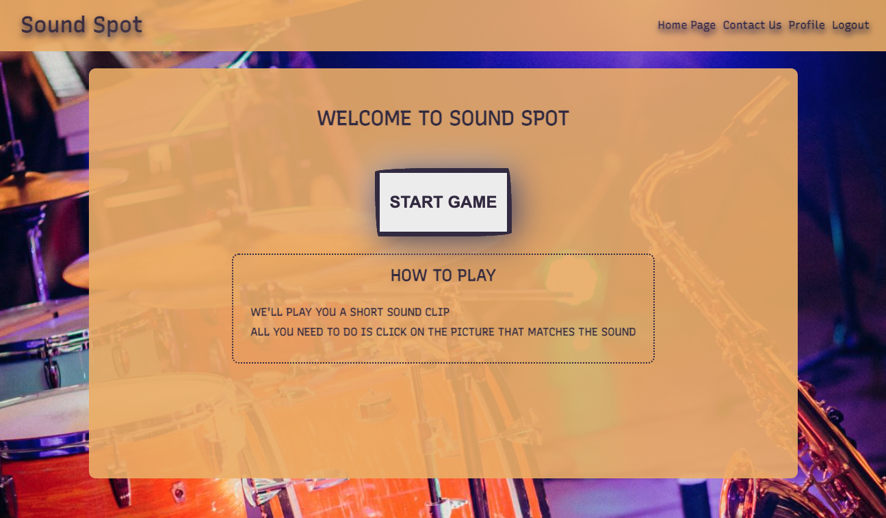

# Sound Spot

### 
Listen and match the sounds to the instruments. Put your ears to the test and see if you have what it takes!

## Table of Contents

- [Deployed link](#deployed-link)
  - [How to play](#how-to-play)
- [Setup](#setup)
  - [Deployment](#deployment)
  - [Technologies](#technologies)
- [Wireframes](#wireframes)
- [Website](#website)

  - [Game page](#game-page)
  - [Register page](#register-page)
  - [Contact page](#contact-page)

- [Credits](#credits)

## Deployed link

[Click here to play Sound Spot!](https://synthlogic.github.io/SoundSpot/)

### How to play

- Click START GAME to begin.
- Press the play button to hear the sound clip.
- Choose the instrument you think played the sound.
- Listen to 10 sound clips for a chance to win the game!
- Register to save your scores.

## Setup

### Deployment

Sound Spot was deployed to heroku.

### Technologies

The [database](https://soundspotgame.herokuapp.com/swagger/index.html) is MongoDB. The backend framework is ASP.NET Core and the language is C#.

## Wireframes

## Website

### Game page

### Register page

### Contact page

## Credits

- Background images are from [unsplash](https://www.unsplash.com) and [pexels](https://www.pexels.com/)
- [Instrument icons and favicon](https://www.flaticon.com/)
- [Color generator](https://www.coolors.co)
- Sounds created by [Mike Avgeros](https://github.com/MikeAvgeros)

To open links in a new browser tab, press CTRL + Click.
